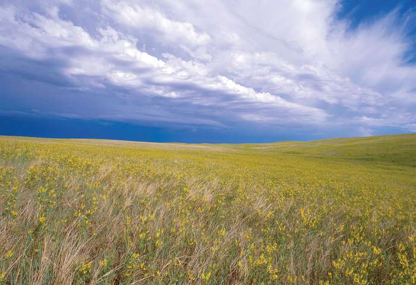

```{r setup, include=FALSE}
knitr::opts_chunk$set(echo = TRUE)

library(tidyverse)
library(janitor)
library(here)
library(ggfortify) #for PCA analysis
library(patchwork) #building compound figures

```

### Overview & Data

This report aims to understand the relationship between cropland coverage (percentage of country's total land under crop cultivation) and a variety of environmental factors including tree canopy cover, mean annual rainfall, annual temperature range, mean annual temperature, wind, and cloudiness. This environmental data used was derived using Google Earth Engine data by Kaggle user @zander_vender who calculated mean values for 243 countries at a reduction scale of about 10km. To assess these relationship I conduct a PCA analysis of the data and generate a PCA biplot which includes loadings and labels.

{width=70%}

### Exploratory Findings

```{r, echo=FALSE, message=FALSE}
world_env_vars <- read_csv(here("data","world_env_vars.csv")) %>% #read in world env. variables csv
  select(elevation, cropland_cover, tree_canopy_cover, rain_mean_annual, temp_annual_range, temp_mean_annual, wind, cloudiness) %>% #select continuous variables
  drop_na() %>% #drop na values
  scale() %>% #scale values
  prcomp() #perform principle components analysis

autoplot(world_env_vars, #generate pca biplot
         loadings = TRUE, #show loadings
         loadings.label = TRUE, #show loading labels
         loadings.colour = "black", #make loading labels black
         loadings.label.colour = "red", #make loading labels black
         loadings.label.vjust = -0.5
         ) +
  theme_minimal()
```

**Figure 1:** A PCA biplot displaying the relationships between cropland cover and other environmental variables.

### Summary

The first 2 principle components displayed on this PCA biplot account for approximately 62% of variance in the data, further:

- Cropland coverage and elevation and highly positively correlated. This suggests that countries with higher elevations have a higher percentage of cropland.
- Mean annual temperature and cropland coverage are highly negatively correlated. This suggests that countries with higher mean annual temperatures have less cropland coverage.
- Annual temperature range is weakly positively correlated with cropland coverage. This suggests that countries with a higher annual temperature range have higher cropland coverage, though it's not necessarily an inhibitor as we see significant cropland cultivation in tropical regions which tend to have smaller annual temperature ranges than higher latitudes.
- Other factors including wind, cloudiness, tree canopy cover, mean annual rainfall show very little to no correlation to cropland coverage.

### Citations

zander_venter. “Environmental Variables for World Countries.” Kaggle.com, 2018, www.kaggle.com/zanderventer/environmental-variables-for-world-countries. Accessed 23 Jan. 2021.
